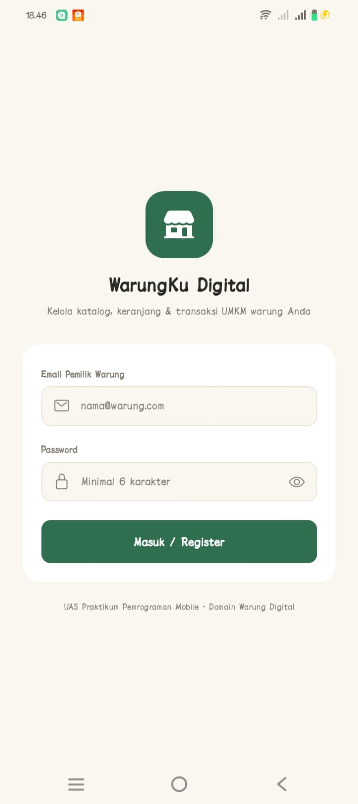
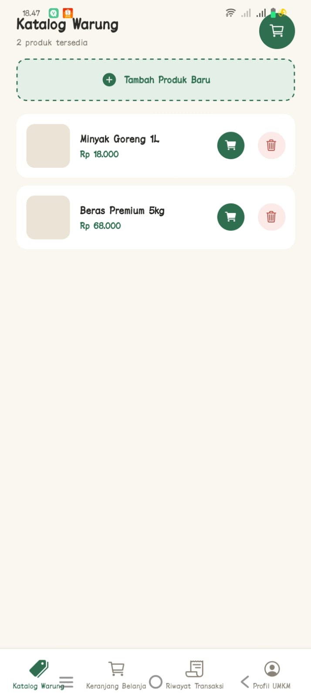
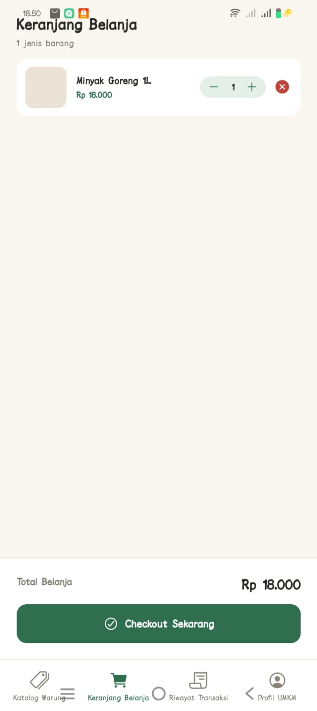

# WarungKu — Domain: Warung Digital


> WarungKu Digital adalah aplikasi kasir & katalog produk untuk pemilik UMKM warung. Aplikasi ini membantu pemilik warung mencatat produk dagangan, mengelola keranjang belanja pelanggan, dan menyimpan riwayat transaksi tanpa perlu koneksi internet, sehingga proses jual-beli di warung jadi lebih rapi dan terdata.

---

## 📸 Screenshots

| Login Screen | Katalog Screen | Keranjang Screen |
|:---:|:---:|:---:|
|  |  |  |

---

## ✨ Fitur Utama

- [x] Login/Register pemilik warung dengan validasi form (email, password minimal 6 karakter)
- [x] Katalog produk dengan FlatList (tambah & hapus produk)
- [x] Detail produk dengan navigasi Stack (kirim parameter antar screen)
- [x] Keranjang belanja dengan stepper kuantitas & total harga otomatis
- [x] Checkout yang tersimpan otomatis ke Riwayat Transaksi
- [x] Foto produk via expo-image-picker (dengan permission handling)
- [x] Data persisten dengan AsyncStorage (sesi user, produk, keranjang, transaksi)
- [x] Bottom Tab Navigation (4 tab: Katalog, Keranjang, Riwayat, Profil)
- [x] Loading state & empty state di setiap daftar data

---

## 🛠️ Tech Stack

| Layer | Teknologi |
|-------|-----------|
| Framework | React Native + Expo (SDK 54) |
| Navigation | React Navigation v7 (Native Stack + Bottom Tab) |
| Storage | @react-native-async-storage/async-storage |
| Device | expo-image-picker (foto produk) |
| Ikon | @expo/vector-icons (Ionicons) |
| Build | EAS Build (Expo Application Services) |

---

## 🚀 Cara Menjalankan

```bash
git clone https://github.com/username/warungku-uas.git
cd warungku-uas
npm install
npx expo start -c
```
Scan QR Code dengan Expo Go di HP.

> Catatan: `react-native-screens` dikunci ke versi `4.16.0` di `package.json` untuk menghindari crash `java.lang.String cannot be cast to java.lang.Boolean` yang terjadi pada versi 4.17.x ke atas di Expo SDK 54.

---

## 📦 Download APK

[Download APK terbaru](LINK_APK_GITHUB_RELEASE_ATAU_DRIVE)

---

## 🌐 Expo Snack

[Buka di Expo Snack](LINK_EXPO_SNACK)

---

## 👤 Developer

**Stephani Della Christin Zai** | 243303621228 | 4 Pagi A
Universitas Prima Indonesia — Prodi Sistem Informasi
Mata Kuliah: Pemrograman Mobile (TI-MOBILE-01)
